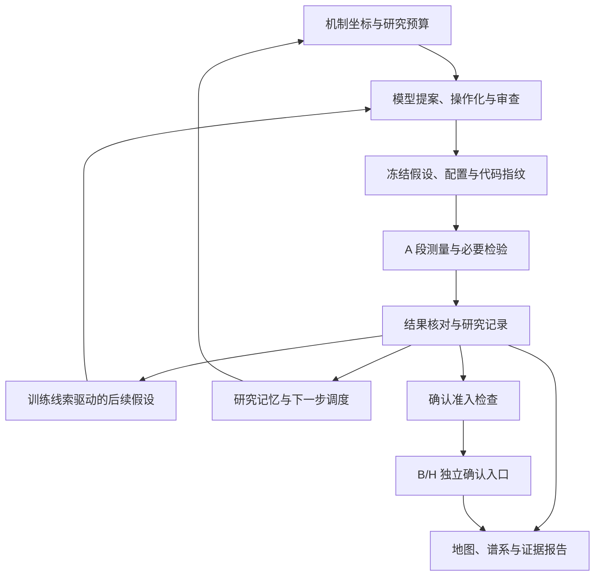

# 核心代码阅读与参赛表述依据

阅读日期：2026-09-09。本次围绕研究主链、证据边界与产品入口进行静态阅读，未执行全市场研究或重新验证全部算法。本文帮助评审从产品表述定位代码，不替代完整代码审计。

## 项目判断

AURORA 的主线是“机制假设 → 冻结实验 → 统计测量 → 证据核对 → 后续假设”，配有研究记忆、持久化恢复和交互控制台。参赛价值集中在研究工作流与证据管理，适合以“可审计的自演化量化研究智能体”定位。

## 核心文件与职责

| 文件 | 阅读到的关键设计 | 适合展示的能力及边界 |
| --- | --- | --- |
| [pipeline.py](../engine/pipeline.py) | 编排冻结、测量、检查点、控制请求与恢复；通过进程锁协调写入 | 研究过程可恢复、结果可追溯；续跑受代码与数据一致性约束 |
| [cycle.py](../engine/cycle.py) | 初始任务、后续任务、研究线索及归纳结果合并 | 后续研究由任务队列承接，能够关联既有观察 |
| [catalog.py](../engine/catalog.py) | 机制族、表达形式及结构合同；校验表达式、必要断言和周期 | 研究对象同时包含经济含义与可检验条件；70 格为初始坐标 |
| [llm.py](../engine/llm.py) | 六类角色的字段白名单、调用预算、重试与缓存 | 模型角色协同且输入受约束；角色数不等于独立模型数 |
| [blades.py](../engine/blades.py) | 安慰剂与必要断言等检验、断言状态计算 | 检验不可用或证据不足时保留未测试状态 |
| [evolution.py](../engine/evolution.py) | 训练段方向线索、条件与交互表达构造、父子比较 | 自演化改变假设；训练选择的方向和条件仍需确认 |
| [memory.py](../engine/memory.py) | 分阶段层次贝叶斯、可识别性诊断及研究计划输出 | 研究记忆服务后续调度，不直接授予统计确认 |
| [evidence.py](../engine/evidence.py) | 盲概率校准、保守财富比、实验性 e 轨迹 | 诊断能力已实现，但正式判定不消费 e 轨迹 |
| [confirmation.py](../engine/confirmation.py) | B/H 单次确认入口、读取前准入、冻结批次 Holm 校正 | 探索与独立确认分开；存在入口不等于已有确认成果 |
| [core.py](../research_sdk/core.py) | 自有面板验证、实验合同、训练选择与验证评估 | 提供独立试用入口；不读取项目行情或调用外部模型 |
| [main.tsx](../src/main.tsx) | 控制台路由、批次与地图、证据等页面入口 | 将研究过程变成可交互的展示与审查界面 |
| [启动脚本](../scripts/start-control-panel.ps1) | 检查环境、构建产物与端口，启动本地服务 | 提供本机演示入口；依赖数据、配置及已有产物 |

其他模块如并行发现、GPU 回归、组合与回测适配，可从 [交付导航](DELIVERY.md) 继续阅读。它们不应仅凭文件存在就被表述为已完成生产部署或收益验证。

## 建议的系统图

此图是完整引擎的概念流程。自有数据 SDK 有单独的实验合同和输出口径，不能用该图暗示其也调用所有模型角色或完整确认流程。

## 本次校准的旧材料表述

| 旧材料中的表述 | 本次使用的口径 | 依据 |
| --- | --- | --- |
| AutoAlpha 与 AURORA 混用 | 对外名称统一为 AURORA Alpha Harness，保留现有包名 | README 的正式名称与实际工程包名可以分开 |
| e 值允许边跑边看且 I 类错误受控 | e 轨迹为实验性诊断，正式确认另有批次判定 | `evidence.py`、`confirmation.py` |
| 五个 LLM 岗位 | 六类角色，共用模型 | `llm.py` 中 `ROLE_FIELDS` |
| 70 个格子压缩整个无限空间 | 70 个初始研究坐标，后续可派生子代 | `catalog.py`、`cycle.py` |
| 旧测试数与旧提案数作为现状 | 采用带日期的归档结果，测试历史与本次验证分开 | 2026-09-09 进展文档 |
| 机构可直接部署、智能投顾应用成熟 | 本地源码试点与 SDK 集成；商业方案待验证 | 交付形态与现有能力边界 |
| 哈希链防篡改 | 指纹与审计支持追溯和一致性校验 | 避免把文件审计机制扩大为不可篡改保证 |

## 结果引用规则

主结果使用 [归档快照](research/2026-09-09-progress.md)及其 [JSON](research/2026-09-09-results.json)。15 个完成候选中 9 个 UNDECIDABLE、6 个 FAIL，独立确认数为 0；6 个子代来自逐候选关系的归档统计。

`report/` 截图作为单独案例，训练 IC、局部区域 IC、重复切分及 promote 状态均按原口径解释。它们不能与上述归档合并计算候选量或确认率。

本次仅更新参赛正文，并新增展示文案和本文；现有 README、界面、引擎及技术报告中的工作区修改予以保留。